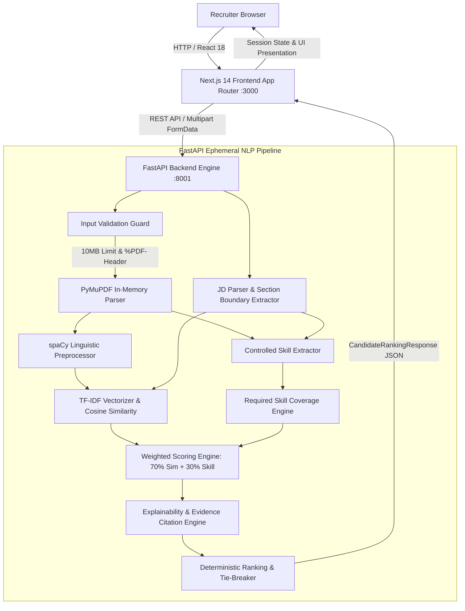

# ResumeIQ

ResumeIQ is an explainable recruitment decision-support platform designed to streamline resume screening and candidate evaluation against complex job descriptions. By pairing a modern Next.js recruiter interface with a deterministic Python NLP matching engine, ResumeIQ provides transparent, evidence-backed candidate scoring and ranking.

ResumeIQ is strictly an objective **recruiter decision-support system**. It evaluates the factual presence of documented technical skills and textual alignment between resume PDFs and job descriptions. It is **NOT** an autonomous hiring system, an automated employee performance predictor, or a candidate success probability calculator. Final hiring decisions, candidate interviews, and qualifications assessments remain exclusively with human recruiters.

---

## Key Capabilities

- **Strict Machine-Readable PDF Ingestion:** Ephemeral, in-memory PDF text extraction powered by PyMuPDF (`fitz`) with character-density and scan detection warnings.
- **Controlled Skill Taxonomy Matching:** Rule-based technical skill extraction utilizing a curated taxonomy of canonical technologies and aliases, reinforced with regex boundary protections for special symbols (e.g., C, C++, C#, .NET).
- **Dual-Metric Objective Scoring:** Deterministic weighted formula combining TF-IDF cosine textual similarity (70%) and required-skill coverage (30%).
- **Explainable Evidence Citations:** Verifiable sentence-level citations with exact page numbers for every detected skill, framed using strict non-inferential absence notation (*"Not found in resume"*).
- **Multi-Candidate Batch Ranking:** Processes up to 50 resumes simultaneously with deterministic tie-breaking and batch failure isolation (corrupt resumes are isolated into structured warnings while valid resumes are ranked).
- **Interactive Recruiter Workspace:** 11 user-facing routes built with Next.js 14, React 18, and Tailwind CSS, featuring candidate leaderboards, side-by-side inspection modals, and custom weighting sliders.

---

## Architecture Overview

ResumeIQ employs a decoupled full-stack architecture with a stateless, ephemeral processing backend:



For complete architectural details, see [docs/ARCHITECTURE.md](docs/ARCHITECTURE.md).

---

## Technology Stack

### Frontend
- **Framework:** Next.js 14.2.15 (App Router)
- **UI Library:** React 18.3.1
- **Language:** TypeScript 5.6.3
- **Styling:** Tailwind CSS 3.4.14 with Stitch UI Design System
- **Icons:** Lucide React

### Backend & API
- **Framework:** FastAPI 0.110.0
- **ASGI Server:** Uvicorn 0.28.0
- **Validation & Settings:** Pydantic v2.6.4 & Pydantic-Settings v2.2.1
- **Testing:** Pytest 9.1.1, HTTPX 0.27.0

### NLP & Matching Engine
- **PDF Extraction:** PyMuPDF (`fitz`) 1.23.26
- **Linguistic Preprocessing:** spaCy 3.7.4 (`en_core_web_sm`)
- **Vectorization & Similarity:** scikit-learn 1.4.1 (unigram/bigram TF-IDF, sublinear term frequency, cosine similarity)

---

## Project Structure

```text
stitch_resumeiq_recruitment_intelligence_platform/
├── .env.local.example               # Frontend environment template
├── docs/                            # Deep-dive architecture, API, and internship reports
│   ├── ARCHITECTURE.md              # Detailed system architecture and data flows
│   ├── API.md                       # Complete REST API endpoint reference
│   ├── INTERNSHIP_REPORT.md         # Final 5-section internship report (Markdown)
│   └── INTERNSHIP_REPORT.pdf        # Production 2-page academic PDF report
├── backend/                         # FastAPI backend service
│   ├── app/
│   │   ├── api/                     # API routers (health, analysis, match, rank)
│   │   ├── core/                    # Application settings (weights, CORS, limits)
│   │   ├── models/                  # Pydantic schemas (resume, job, analysis)
│   │   ├── services/                # Extraction, preprocessing, similarity, scoring
│   │   └── main.py                  # FastAPI application entrypoint
│   ├── data/                        # Static evaluation datasets & job requisitions
│   ├── evaluation/                  # Automated benchmark harness, metrics & reports
│   ├── tests/                       # 59 automated unit, integration & boundary tests
│   ├── README.md                    # Backend-specific architecture & developer guide
│   └── requirements.txt             # Python dependencies
├── public/                          # Static assets and sample candidate PDFs
│   └── samples/                     # Demo resumes and job descriptions
├── resumeiq/                        # Stitch design specifications (DESIGN.md)
└── src/                             # Next.js App Router frontend
    ├── app/                         # 11 user-facing routes + layout & not-found handler
    ├── components/                  # UI components, layout shell, domain modules
    ├── context/                     # Client authentication context
    ├── lib/                         # Mock fallback data and utilities
    ├── services/                    # API client, candidate mapping, export services
    ├── styles/                      # Global styles and Tailwind directives
    └── types/                       # TypeScript interfaces
```

---

## Installation & Setup

### Prerequisites
- **Node.js:** v18.17.0+ (v20+ recommended)
- **Python:** v3.10+ (v3.11 recommended)
- **Package Managers:** npm (Node) and pip (Python)

### 1. Backend Setup

Open a terminal dedicated to the backend service:

#### Windows (PowerShell):
```powershell
# 1. Create and activate virtual environment
python -m venv .venv
.venv\Scripts\Activate.ps1

# 2. Install dependencies
pip install -r backend/requirements.txt

# 3. Download the spaCy linguistic model
python -m spacy download en_core_web_sm

# 4. Set Python path and start the FastAPI server
$env:PYTHONPATH="backend"
python -m uvicorn app.main:app --host 127.0.0.1 --port 8001 --reload
```

#### Linux / macOS (Bash):
```bash
# 1. Create and activate virtual environment
python3 -m venv .venv
source .venv/bin/activate

# 2. Install dependencies
pip install -r backend/requirements.txt

# 3. Download the spaCy linguistic model
python -m spacy download en_core_web_sm

# 4. Set Python path and start the FastAPI server
export PYTHONPATH=backend
python -m uvicorn app.main:app --host 127.0.0.1 --port 8001 --reload
```

Once running, access the backend at:
- **Base Service:** http://127.0.0.1:8001
- **Interactive Swagger Docs:** http://127.0.0.1:8001/docs
- **Health Check:** http://127.0.0.1:8001/api/v1/health

---

### 2. Frontend Setup

Open a second terminal for the Next.js web application:

```bash
# 1. Install Node dependencies
npm install

# 2. Configure environment (optional, defaults to http://127.0.0.1:8001/api/v1)
# On Windows PowerShell:
Copy-Item .env.local.example .env.local
# On Linux/macOS:
cp .env.local.example .env.local

# 3. Launch development server
npm run dev
```

Open your browser to:
- **Web Interface:** http://localhost:3000

---

## API Summary & Security Hardening

FastAPI exposes endpoints prefixed under `/api/v1`:

| Method | Endpoint | Description | Input / Payload | Key Status Codes |
| :--- | :--- | :--- | :--- | :--- |
| `GET` | `/` | Root service metadata | None | `200` |
| `GET` | `/api/v1/health` | Health check endpoint | None | `200` |
| `POST` | `/api/v1/analyze/resume` | Single resume text extraction & skill detection | `file: UploadFile` | `200`, `400`, `413`, `422` |
| `POST` | `/api/v1/analyze/match` | Resume-to-Job matching & scoring | `file: UploadFile`, `job_description: Form` | `200`, `400`, `413`, `422` |
| `POST` | `/api/v1/analyze/rank` | Multi-candidate batch ranking | `files: List[UploadFile]`, `job_description: Form` | `200`, `400`, `413` |

### Milestone 6 Security Controls
- **10MB Upload Limit:** Strict byte-length enforcement on all file uploads (`settings.MAX_FILE_SIZE_BYTES = 10MB`). Uploads exceeding 10MB immediately return `HTTP 413 Payload Too Large`.
- **Magic-Byte Signature Validation:** Uploaded PDFs are validated to begin with `%PDF-` (`b"%PDF-"`). Renamed binaries, malicious scripts, or empty files return `HTTP 400 Bad Request`.
- **50-Candidate Batch Cap:** Batch ranking requests are capped at 50 files (`settings.MAX_RANK_BATCH_SIZE = 50`). Excess requests return `HTTP 400 Bad Request`.
- **Batch Failure Isolation:** Corrupt or invalid resumes in a batch do not abort execution. Valid candidates are evaluated and ranked; corrupted files are safely collected into `failed_candidates` and `warnings`.
- **All-Invalid Batch Guard:** If all uploaded files fail validation, `/rank` returns `HTTP 400 Bad Request` with an aggregated diagnostic summary.
- **Exception Sanitization:** Broad exceptions return clean JSON error structures without leaking stack traces or internal server directories.

For complete endpoint schemas, see [docs/API.md](docs/API.md).

---

## Matching & Scoring Methodology

ResumeIQ implements a deterministic mathematical matching formulation:

$$\text{Overall Score} = 0.70 \times \text{Text Similarity} + 0.30 \times \text{Required Skill Coverage}$$

1. **Text Similarity (70%):**
   - Candidate resume text and Job Description text are cleaned and normalized via spaCy (`en_core_web_sm`).
   - Technical multi-character terms (`c++`, `node.js`, `ci/cd`, etc.) are protected prior to tokenization.
   - Stop words and generic punctuation are filtered out, and standard words are lemmatized.
   - scikit-learn `TfidfVectorizer(ngram_range=(1, 2), sublinear_tf=True)` computes normalized term vectors.
   - Cosine similarity produces an objective lexical alignment score between `0.0` and `100.0%`.
2. **Required Skill Coverage (30%):**
   - Job Description parser extracts explicit required skills.
   - Strict section boundary rules ensure preferred/bonus skills are never evaluated as mandatory requirements.
   - Controlled skill extractor scans resume text using dual-boundary regex to prevent partial substring matches.
   - Coverage represents the percentage of required skills documented in the resume.
3. **Deterministic Ranking:**
   - Candidate rankings are sorted descending by `overall_score`, then `text_similarity`, then `skill_coverage`, with alphabetical `filename` sorting as a deterministic tie-breaker.

---

## Explainability & Absence Framing

ResumeIQ enforces a strict, non-inferential evidence policy:
- **Evidence Citations:** When a skill is matched, the engine records the matching snippet, the sentence context, and the exact page number.
- **Absence Framing:** When a skill is not found, the system displays:
  - Frontend Badge: `"Not found in resume"`
  - Backend Diagnostic: `"Skill '<skill>' was not explicitly identified in the parsed resume text."`
- **Non-Inferential Principle:** The engine never claims that a candidate "lacks competence" or "does not know" a technology; it reports only the factual presence or absence of textual documentation within the submitted PDF.

---

## Benchmark Evaluation

ResumeIQ includes an automated, reproducible evaluation framework (`backend/evaluation/`):
- **Dataset:** 10 diverse synthetic resumes (`candidate_alpha.pdf` through `candidate_iota.pdf`, plus `scanned_image_resume.pdf`) and 4 technical job descriptions (`ml_engineer.txt`, `software_engineer.txt`, `frontend_engineer.txt`, `devops_engineer.txt`).
- **Ground Truth Annotations:** Expert-annotated skill and ranking datasets (`skill_annotations.json`, `ranking_annotations.json`).
- **Empirical Measured Metrics (Controlled Benchmark):**
  - **Skill Extraction Precision:** 100.00%
  - **Skill Extraction Recall:** 100.00%
  - **Skill Extraction F1 Score:** 100.00%
  - **Ranking Quality (Mean NDCG@5):** 1.0000
- **Regression Anchor:** `candidate_alpha.pdf` vs `ml_engineer.txt` strictly reproduces:
  - Overall Score: `40.76`
  - Text Similarity: `15.37%`
  - Required Skill Coverage: `100.0%` (5 matched, 0 missing)

*Note: These metrics represent empirical performance on the controlled synthetic benchmark dataset and should not be construed as a guarantee of 100% accuracy across unconstrained real-world documents with non-standard visual formatting.*

---

## Frontend Routes

The Next.js App Router provides 11 user-facing routes (plus the internal `/_not-found` handler, for 12 routes in the build manifest and 13 static/dynamic page generation steps):

1. **`/`** — Product landing page with feature highlights and recruitment workflow explanation.
2. **`/sign-in`** — Recruiter portal sign-in with quick-demo credentials.
3. **`/sign-up`** — Account registration interface.
4. **`/overview`** — Dashboard overview with active candidate counts, recent requisitions, and analytics cards.
5. **`/new-analysis`** — 3-step candidate upload wizard: job description input, resume drag-and-drop zone, and synthetic demo sample loader.
6. **`/requirements-review`** — Interactive parser review for editing extracted required skills and adjusting scoring weights.
7. **`/analysis`** — Candidate ranking leaderboard with interactive filtering ribbons, match tiers, and score breakdown bars.
8. **`/candidates/[id]`** — Detailed candidate evaluation view, sentence-level citation cards, and side-by-side resume inspection modal.
9. **`/reports`** — Analytics reporting interface with requisition summaries, CSV/JSON data export, and print-ready PDF reports.
10. **`/settings`** — System configuration interface displaying active API endpoints, NLP model status, and preferences.
11. **`/profile`** — Recruiter profile management, notification toggles, and security settings.

---

## Deployment

ResumeIQ is deployed across two cloud hosting environments with a decoupled architecture:

- **Frontend Hosting:** [Vercel](https://vercel.com) (Next.js 14 App Router)
  - **Live URL:** https://resume-iq-five-umber.vercel.app/
  - **Environment Variable:** `NEXT_PUBLIC_API_BASE_URL=https://resumeiq-backend-0gt7.onrender.com/api/v1`
- **Backend Hosting:** [Render](https://render.com) (Python 3.11 / FastAPI / Uvicorn)
  - **Live URL:** https://resumeiq-backend-0gt7.onrender.com/
  - **Health Endpoint:** https://resumeiq-backend-0gt7.onrender.com/api/v1/health
  - **Swagger API Docs:** https://resumeiq-backend-0gt7.onrender.com/docs
  - **Environment Variables:**
    - `PYTHONPATH`: `backend`
    - `CORS_ORIGINS`: `["http://localhost:3000","http://127.0.0.1:3000","https://resume-iq-five-umber.vercel.app"]`
- **Deployment Architecture:**
  - The Next.js frontend is deployed serverlessly on Vercel, pointing all recruitment analysis requests to the Render backend via HTTPS.
  - The FastAPI backend runs as a cloud web service on Render, executing stateless in-memory PDF parsing, TF-IDF cosine similarity, and candidate ranking.
  - Production CORS explicitly permits cross-origin requests from the Vercel frontend origin while preserving local development access.

---

## Verification & Testing

### Running Backend Tests
Execute the complete test suite (59 tests covering API routes, parser boundaries, scoring weights, and security limits):
```bash
python -m pytest backend/tests
```

### Running Frontend Production Build
Validate Next.js compilation, TypeScript types, and route generation:
```bash
npm run build
```

---

## Known Limitations

1. **Machine-Readable PDF Requirement:** ResumeIQ extracts text using PyMuPDF. PDFs containing scanned images or bitmap text will emit low-character warnings. Optical Character Recognition (OCR) is deliberately omitted to prevent heavy, uncalibrated binary dependencies.
2. **Controlled Evaluation Scope:** Benchmark precision and recall were validated on a controlled synthetic corpus. Unconstrained real-world resumes with tables, columns, or unconventional layouts may require expanded heuristic rules.
3. **Stateless Session Storage:** ResumeIQ operates ephemerally in-memory for security and privacy. Requisitions and ranking state are cached in the browser's `sessionStorage` and are not persisted to a database.
4. **Recruiter Decision Support:** ResumeIQ provides objective text-matching metrics. It does not replace qualitative human interviews or comprehensive candidate evaluations.

---

## License & Attribution

Developed as an advanced recruitment intelligence and recruiter decision-support system. All synthetic test datasets are anonymized and free of Personally Identifiable Information (PII).
