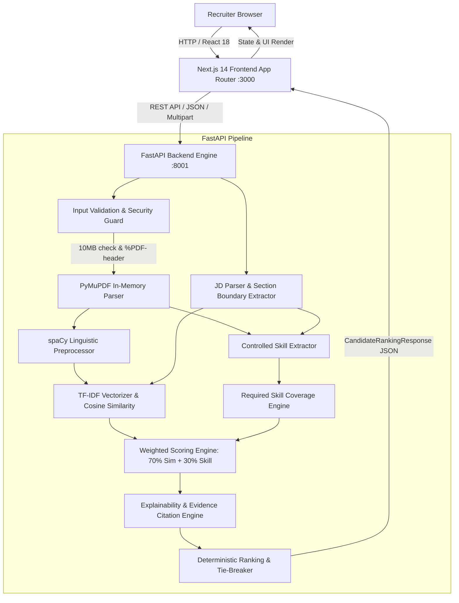

# ResumeIQ — Milestone 7 Audit Report: Final Documentation & Deployment Readiness
**Audit Date:** 2026-10-02  
**Audit Phase:** Milestone 7 — Phase 1 (Documentation, Reproducibility & Deployment Readiness Audit)  
**Latest Verified Commit:** `bd7575749bee4d980eb00f740acb1059b51739e8` (`feat(security): harden API uploads and batch processing`)  
**Repository State:** Clean working tree. Application code FROZEN. Zero code modifications.

---

## 1. Executive Summary

This audit assesses the current state of documentation, environment configuration, setup reproducibility, deployment readiness, and academic/internship reporting materials for the **ResumeIQ Recruitment Intelligence Platform**.

Over Milestones 1 through 6, ResumeIQ was built, tested, integrated, evaluated, tuned, and security-hardened. The platform comprises:
1. **Frontend:** A Next.js 14 (App Router) TypeScript application featuring 13 prerendered/dynamic routes, a Stitch-designed interface, dark/light theme support, interactive candidate ranking comparisons, and an evidence citation modal.
2. **Backend:** A FastAPI Python service providing deterministic PDF text extraction (PyMuPDF), technical term preservation and linguistic normalization (spaCy), controlled skill taxonomy matching with boundary protections, TF-IDF cosine similarity (scikit-learn), explainable evidence generation, and weighted multi-candidate ranking.
3. **Security Hardening (Milestone 6):** 10MB upload payload limits (HTTP 413), `%PDF-` magic-byte validation (HTTP 400), 50-file batch capping (HTTP 400), batch candidate failure isolation with non-breaking warnings/errors, and Starlette exception sanitization.
4. **Evaluation Benchmark (Milestones 4 & 5):** 100% precision, 100% recall, 100% F1 score, and 1.0000 Mean NDCG@5 on the controlled synthetic evaluation dataset (10 resumes, 4 job requisitions).
5. **Frozen Regression Anchor:** `candidate_alpha.pdf` vs `ml_engineer.txt` strictly yields Overall Score **40.76**, Text Similarity **15.37%**, Skill Coverage **100.0%** (5 matched, 0 missing).

### Primary Audit Finding
While the backend (`backend/README.md`) and evaluation framework (`backend/evaluation/README.md`) have comprehensive documentation, the **repository root completely lacks a top-level `README.md`**. A newly onboarded developer or reviewer cloning the repository receives no guidance on platform purpose, end-to-end full-stack setup, architecture, or unified verification. Creating a unified root `README.md` and an internship summary report is the highest-priority deliverable for Milestone 7 Phase 2.

---

## 2. Current Documentation Inventory

| File Path | Size | Primary Purpose | Status / Health |
| :--- | :--- | :--- | :--- |
| `README.md` (root) | *0 bytes* | **MISSING**. Root directory has no README file. | **P0 GAP** |
| `backend/README.md` | 11,295 B | FastAPI architecture, endpoints, setup, limitations, scoring, security. | Up to date (Updated in M6) |
| `backend/evaluation/README.md` | 6,603 B | Evaluation metrics (P/R/F1, NDCG@K), execution commands, ethics. | Up to date (M4/M5) |
| `backend/evaluation/MILESTONE_5_REPORT.md` | 17,534 B | Comprehensive tuning report: taxonomy fixes, C/C++ regex, 70/30 scoring validation. | Up to date (M5) |
| `backend/evaluation/MILESTONE_5_SCORING_EXPERIMENT.md` | 8,367 B | Experimental comparison of 50/50, 60/40, 70/30, 80/20 scoring weights. | Up to date (M5) |
| `backend/evaluation/MILESTONE_6_AUDIT.md` | 23,826 B | Security audit of API endpoints, memory streaming, file limits. | Up to date (M6) |
| `backend/evaluation/MILESTONE_6_IMPLEMENTATION_REPORT.md` | 10,654 B | Verification of Tests A–J, 10MB limits, batch isolation, git hygiene. | Up to date (M6) |
| `backend/evaluation/results/evaluation_report.md` | 8,206 B | Benchmark results on synthetic dataset (10 resumes, 4 JDs). | Up to date (M5) |
| `resumeiq/DESIGN.md` | 10,425 B | Design system tokens, color palettes, elevation, typography, components. | Up to date (M1 Stitch) |
| `.env.local.example` | 57 B | Frontend API URL configuration template (`NEXT_PUBLIC_API_BASE_URL`). | Accurate |

---

## 3. Repository Documentation Audit

### 3.1 Root README Evaluation
- **Current State:** Non-existent.
- **Deficiencies:**
  - No platform overview or problem statement explaining why ResumeIQ exists (transparent recruiter decision support vs black-box generative AI).
  - No end-to-end architecture diagram showing how Next.js connects to FastAPI.
  - No unified setup instructions guiding a developer through both frontend (`npm install && npm run dev`) and backend (`pip install -r backend/requirements.txt && uvicorn ...`).
  - No quickstart guide for running automated tests across both stacks.
  - No index of available reports and evaluation artifacts.

### 3.2 Backend README Evaluation
- **Current State:** Comprehensive 12-section document.
- **Strengths:** Accurately documents endpoints, scoring formula (70/30), Milestone 6 input safeguards, spaCy term preservation, and OCR exclusion rationale.
- **Minor Outdated Items / Gaps:**
  - Mentions `python -m uvicorn app.main:app` which requires setting `PYTHONPATH=backend` on Windows PowerShell; explicit commands for Windows PowerShell vs Linux/macOS bash should be highlighted.

---

## 4. System Architecture Audit

The implementation reflects a clean two-tier decoupled architecture:



### Architectural Integrity Verification
- **Frontend Framework:** Next.js 14.2.15 App Router using React 18 and Tailwind CSS.
- **Backend Framework:** FastAPI 0.110.0 running under Uvicorn 0.28.0 on Python 3.11.
- **Coupling Level:** Loosely coupled via RESTful HTTP endpoints (`/api/v1/*`). Frontend gracefully operates with offline fallback data if backend is unreachable.
- **Statelessness:** Zero server-side persistent database or disk file cache. All analysis is ephemeral and stream-processed in memory.

---

## 5. Data Flow Audit

1. **Upload Initiation:**
   - User drops 1 to 50 PDF resumes and enters or selects a Job Description in `/new-analysis`.
   - Frontend bundles files into a `FormData` multipart payload.
2. **Transport & Ingestion:**
   - Sent to `POST /api/v1/analyze/rank` (or `/match` for single candidate).
   - Ingestion enforces `MAX_FILE_SIZE_BYTES` (10MB) and `MAX_RANK_BATCH_SIZE` (50 files).
3. **In-Memory Text Extraction:**
   - Raw bytes checked for `%PDF-` signature.
   - PyMuPDF opens byte stream in memory (`fitz.open(stream=..., filetype="pdf")`).
   - Text extracted page by page with character counts and page-number metadata.
4. **Natural Language Processing & Skill Detection:**
   - spaCy normalizes text while protecting tokens (`c++`, `node.js`, `ci/cd`, etc.).
   - Regex taxonomy matching extracts canonical skills and citations.
5. **Similarity & Scoring:**
   - scikit-learn `TfidfVectorizer` computes unigram/bigram sublinear TF-IDF vectors.
   - Cosine similarity produces text similarity percentage (0–100%).
   - Set intersection against JD required skills computes coverage percentage (0–100%).
   - Weighted score = `0.70 * text_similarity + 0.30 * skill_coverage`.
6. **Persistence & Client Storage:**
   - **Backend:** Ephemeral; zero files or records written to disk or database.
   - **Frontend:** Analysis results cached in client `sessionStorage` (`resumeiq_active_ranking`) for seamless navigation across `/analysis` and `/candidates/[id]`. Candidate notes saved in `sessionStorage` (`resumeiq_notes_*`). Auth state held in `localStorage` / `sessionStorage`.

---

## 6. API Documentation Audit

FastAPI automatically serves interactive OpenAPI documentation at `/docs` (Swagger UI) and `/redoc`.

| Method | Endpoint | Input Payload | Response Model | HTTP Status Codes |
| :--- | :--- | :--- | :--- | :--- |
| `GET` | `/` | None | Service metadata JSON | `200` |
| `GET` | `/docs` | None | Swagger UI HTML | `200` |
| `GET` | `/redoc` | None | Redoc UI HTML | `200` |
| `GET` | `/api/v1/health` | None | `{"status":"ok","service":"...","version":"..."}` | `200` |
| `POST` | `/api/v1/analyze/resume` | `file: UploadFile` | `ResumeParseResponse` | `200`, `400` (non-PDF/empty), `413` (>10MB), `422` (parse failure) |
| `POST` | `/api/v1/analyze/match` | `file: UploadFile`, `job_description: Form[str]` | `CandidateAnalysis` | `200`, `400` (empty JD/bad PDF), `413` (>10MB), `422` |
| `POST` | `/api/v1/analyze/rank` | `files: List[UploadFile]`, `job_description: Form[str]` | `MultiCandidateRankingResponse` | `200`, `400` (empty JD/batch >50/all invalid), `413` |

### Hardened Batch Processing Audit
- Corrupt resumes in a multi-file batch do not crash the batch.
- Valid resumes are ranked; corrupt files are listed in `failed_candidates: [{"filename": "...", "error": "..."}]` and non-fatal `warnings: [...]`.
- Response model guarantees schema backward compatibility.

---

## 7. Frontend Documentation Audit

The Next.js App Router defines 13 production routes (prerendered static `○` or server dynamic `ƒ`):

1. `/` (`src/app/page.tsx`): Product landing page, feature highlights, and recruitment workflow overview.
2. `/_not-found`: Custom 404 error page.
3. `/sign-in` (`src/app/sign-in/page.tsx`): Recruiter sign-in portal with demo credentials toggle.
4. `/sign-up` (`src/app/sign-up/page.tsx`): Account registration portal.
5. `/overview` (`src/app/(dashboard)/overview/page.tsx`): Executive recruitment dashboard, metric cards, recent candidate requisitions.
6. `/new-analysis` (`src/app/(dashboard)/new-analysis/page.tsx`): 3-step upload workflow: JD entry, resume drag-and-drop, sample dataset loader.
7. `/requirements-review` (`src/app/(dashboard)/requirements-review/page.tsx`): Interactive parser review for required vs preferred skills and custom weighting.
8. `/analysis` (`src/app/(dashboard)/analysis/page.tsx`): Candidate ranking leaderboard, filtering ribbons, score breakdown, and match tier badges.
9. `/candidates/[id]` (`src/app/(dashboard)/candidates/[id]/page.tsx`): Deep candidate evaluation view, sentence-level citation cards, side-by-side inspection modal.
10. `/reports` (`src/app/(dashboard)/reports/page.tsx`): Analytics summaries, candidate comparison tables, JSON export, and print-ready PDF reporting.
11. `/settings` (`src/app/(dashboard)/settings/page.tsx`): API endpoint configuration, model status inspection, and user preferences.
12. `/profile` (`src/app/(dashboard)/profile/page.tsx`): Recruiter profile, role settings, notification toggles, and security preferences.

---

## 8. NLP & Matching Methodology Audit

ResumeIQ employs an intentional, explainable, deterministic NLP pipeline rather than opaque generative AI:

1. **PDF Text Extraction:**
   - Powered by `PyMuPDF` (MuPDF C-library bindings).
   - Extracts character streams with exact page numbering and whitespace normalization.
   - Detects low text density (<40 characters) and emits warnings for scanned/image PDFs.
2. **Linguistic Preprocessing:**
   - Powered by `spaCy` (`en_core_web_sm`).
   - Custom token protection maps terms like `c++` → `cplusplus`, `node.js` → `nodejs`, `ci/cd` → `cicd` before tokenization.
   - Lowercases, strips punctuation, eliminates English stop words, and applies lemmatization.
3. **Controlled Skill Taxonomy Matching:**
   - Curated dictionary of technical skills and aliases across Software Engineering, Machine Learning, DevOps, and Data Science.
   - Dual-boundary regex protection prevents character collision (e.g., C/C++ regex protects against bare English letter "C" matches).
   - Case-sensitive deterministic matching for short programming languages (e.g., lowercase English "go" does not match Go programming language).
4. **TF-IDF & Cosine Similarity:**
   - `TfidfVectorizer(ngram_range=(1, 2), min_df=1, max_df=1.0, sublinear_tf=True)`.
   - Computes cosine similarity of L2-normalized term vectors between resume and JD.
5. **Scoring Formulation:**
   - Deterministic weighted sum:
     $$	ext{Overall Score} = 0.70 	imes 	ext{Text Similarity} + 0.30 	imes 	ext{Required Skill Coverage}$$
   - Both weights are validated at startup to strictly sum to 1.0.
   - Strictly framed as an objective text-matching heuristic, **not** an automated hiring decision or employee success predictor.

---

## 9. Explainability & Ethical Audit

### 9.1 Evidence Citation Framing
Every required skill evaluated by the engine generates a structured `RequirementEvidence` record:
- **Matched Skill:** Provides the exact extracted sentence context and page number citation where the candidate documented the skill.
- **Unmatched Skill:** Framed with strict non-inferential language:
  - Backend message: `"Skill '<skill>' was not explicitly identified in the parsed resume text."`
  - Frontend display badge: `"Not found in resume"`
- **Strict Anti-Inference Policy:** The system explicitly avoids stating that a candidate "lacks" or "does not possess" a skill; it reports only the factual presence or absence of textual documentation.

### 9.2 Ethical Safeguards
- **Zero Demographic Parsing:** Resumes are processed without extracting or scoring gender, age, race, ethnicity, religion, disability status, or geographic location.
- **Deterministic Recruiter Assistance:** The platform acts as a screening decision-support aid. Final evaluation, interview selection, and hiring decisions remain solely with human recruiters.

---

## 10. Evaluation Framework Audit

The repository contains a fully automated evaluation framework under `backend/evaluation/`:
- **Synthetic Benchmark Dataset:** 10 diverse synthetic resumes (`candidate_alpha.pdf` through `candidate_iota.pdf` plus `scanned_image_resume.pdf`) and 4 realistic job descriptions (`ml_engineer.txt`, `software_engineer.txt`, `frontend_engineer.txt`, `devops_engineer.txt`).
- **Ground Truth Annotations:** Expert-verified JSON annotations for skill extraction (`skill_annotations.json`) and ranking order (`ranking_annotations.json`).
- **Empirical Measured Metrics:**
  - **Skill Precision:** 100.00%
  - **Skill Recall:** 100.00%
  - **Skill F1 Score:** 100.00%
  - **Ranking Quality (Mean NDCG@5):** 1.0000
- **Controlled Scope Disclosure:** Documentation explicitly clarifies that these 100% scores represent verified performance on the controlled 10-candidate benchmark dataset and do not imply error-free performance across unconstrained real-world resumes with arbitrary formatting.

---

## 11. Security Hardening Audit (Milestone 6 Verification)

All Milestone 6 security enhancements were verified in active source code:
1. **10MB Upload Limit:** Enforced in `validate_and_read_pdf_upload` and `_process_candidate_evaluation` via `settings.MAX_FILE_SIZE_BYTES`. Rejects payloads >10MB with HTTP 413.
2. **Magic Byte Verification:** Checks `content.startswith(b"%PDF-")`. Renamed text, binary, or empty files are rejected upfront with HTTP 400.
3. **Batch Size Capping:** `len(files) > settings.MAX_RANK_BATCH_SIZE` (50) raises HTTP 400.
4. **Batch Failure Isolation:** In `/api/v1/analyze/rank`, per-file try/except blocks append invalid files to `failed_candidates` and `warnings` without interrupting the ranking of valid candidates.
5. **All-Invalid Batch Error:** Batches where all files fail return HTTP 400 detailing failure reasons.
6. **Exception Sanitization:** Broad exceptions return clean JSON error responses without leaking internal filesystem paths or stack traces.
7. **Repository Hygiene:** `.gitignore` includes virtual environments, IDE metadata, and logs.

---

## 12. Environment Configuration Audit

- **Frontend Configuration:**
  - File: `.env.local.example`
  - Variable: `NEXT_PUBLIC_API_BASE_URL=http://127.0.0.1:8001/api/v1`
  - Fallback: Defaults to `"http://127.0.0.1:8001/api/v1"` in `src/services/api.ts` if `.env.local` is omitted.
- **Backend Configuration:**
  - File: `backend/app/core/config.py` using Pydantic `BaseSettings`.
  - Configurable via environment variables: `PROJECT_NAME`, `API_V1_PREFIX`, `TEXT_SIMILARITY_WEIGHT`, `REQUIRED_SKILL_WEIGHT`, `CORS_ORIGINS`, `MAX_FILE_SIZE_BYTES`, `MAX_RANK_BATCH_SIZE`, `SPACY_MODEL`.
- **Developer Clarity:** High. No hidden secrets, credentials, or proprietary API keys are required to execute the platform.

---

## 13. Setup & Reproducibility Audit

### 13.1 Reproduction Steps
A fresh clone requires two independent runtime environments:

**Terminal 1 — Backend (Python 3.10+):**
```powershell
# Create & activate virtual environment
python -m venv .venv
.venv\Scripts\Activate.ps1    # On Linux/macOS: source .venv/bin/activate

# Install dependencies
pip install -r backend/requirements.txt

# Download spaCy linguistic model
python -m spacy download en_core_web_sm

# Launch FastAPI development server (set PYTHONPATH to backend)
$env:PYTHONPATH="backend"     # On Linux/macOS: export PYTHONPATH=backend
python -m uvicorn app.main:app --host 127.0.0.1 --port 8001 --reload
```

**Terminal 2 — Frontend (Node.js 18+):**
```powershell
# Install npm packages
npm install

# (Optional) Configure environment
Copy-Item .env.local.example .env.local

# Launch Next.js development server
npm run dev
# Opens at http://localhost:3000
```

---

## 14. Testing Documentation Audit

| Test Suite | File | Items | Status |
| :--- | :--- | :--- | :--- |
| API Endpoints & Hardening | `backend/tests/test_api_endpoints.py` | 15 items | **Passed** |
| Evaluation Framework | `backend/tests/test_evaluation.py` | 6 items | **Passed** |
| Explainability Engine | `backend/tests/test_explanation.py` | 2 items | **Passed** |
| JD Parser & Boundaries | `backend/tests/test_jd_parser.py` | 5 items | **Passed** |
| PDF Extraction & Warnings | `backend/tests/test_pdf_parser.py` | 4 items | **Passed** |
| Text Preprocessing | `backend/tests/test_preprocessor.py` | 4 items | **Passed** |
| Scoring Weights & Limits | `backend/tests/test_scoring.py` | 3 items | **Passed** |
| TF-IDF Cosine Similarity | `backend/tests/test_similarity.py` | 3 items | **Passed** |
| Skill Taxonomy & Extraction | `backend/tests/test_skill_extractor.py` | 17 items | **Passed** |
| **Total Test Suite** | `python -m pytest backend/tests` | **59 passed, 1 warning** | **Passed (9.56s)** |
| **Frontend Production Build** | `npm.cmd run build` | **13 routes compiled** | **Passed** |

---

## 15. Deployment Readiness Audit

| Assessment Dimension | Readiness Status | Empirical Evidence & Operational Reality |
| :--- | :--- | :--- |
| **A. Development-Ready** | **Fully Ready** | Clean dev server startup for both Next.js and FastAPI with hot reload. |
| **B. Demo-Ready** | **Fully Ready** | 13 polished routes, interactive sliders, sample datasets in `public/samples/`, instant analysis results. |
| **C. Documentation-Ready** | **Requires Root README** | Backend and evaluation are well documented; root project README is missing. |
| **D. Deployment-Ready** | **Partially Ready** | Static build succeeds; needs public CORS configuration and production host domain in `.env.local`. |
| **E. Production-Ready** | **Controlled Scope** | Excellent stateless screening engine. Lacks multi-tenant database, persistent auth, and Docker/k8s orchestration. |

---

## 16. Internship Report Audit

The internship guidelines require a 1–2 page PDF report covering:
1. **Introduction:** Context of automated recruitment, resume volume challenges, recruiter fatigue, and the need for explainable decision support over opaque generative AI.
2. **Abstract:** High-level summary of ResumeIQ: a deterministic, full-stack recruitment intelligence platform utilizing PyMuPDF, spaCy, controlled skill taxonomy matching, TF-IDF cosine similarity, and 70/30 scoring.
3. **Tools Used:** Next.js 14, React 18, TypeScript, Tailwind CSS, FastAPI, Uvicorn, Pydantic v2, PyMuPDF, spaCy, scikit-learn, pytest.
4. **Steps Involved:** Milestones 1–6 (UI import, backend engine, integration, evaluation harness, taxonomy tuning, security hardening).
5. **Conclusion & Future Work:** Summary of achievements (100% benchmark F1, 1.0000 NDCG@5, 40.76 regression anchor) and future roadmap (OCR integration, semantic ontology expansion).

All necessary facts, architecture diagrams, and empirical metrics are directly available from repository code and evaluation artifacts.

---

## 17. Documentation Gap Matrix

| Area | Existing Documentation | Missing / Outdated | Recommended Action | Priority |
| :--- | :--- | :--- | :--- | :---: |
| **Root Project README** | None (File missing) | Complete platform overview, unified setup, architecture, and navigation guide | Create comprehensive root `README.md` | **P0** |
| **Reproducibility & Setup** | `backend/README.md` | OS-specific instructions for Windows PowerShell (`PYTHONPATH=backend`) and full-stack startup | Add dual-terminal setup guide to root README | **P0** |
| **Internship Report** | None | Formal 1–2 page PDF summary report for academic/internship submission | Draft report text and generate clean PDF artifact | **P1** |
| **Backend README** | `backend/README.md` | PowerShell execution tips for Windows developers | Add cross-platform execution hints | **P2** |
| **Frontend Documentation** | `resumeiq/DESIGN.md` | Component architecture and route directory explanation | Document 13 frontend routes in root README | **P1** |
| **Deployment Guide** | None | Guidance on hosting Next.js on Vercel and FastAPI on cloud container runtimes | Add deployment section to root README | **P2** |

---

## 18. Recommended Documentation Plan (Milestone 7 Phase 2)

1. **Create Root `README.md` (P0):**
   - Project overview, recruiter decision-support value proposition.
   - High-level architecture diagram.
   - Unified prerequisite checklist and dual-terminal startup commands.
   - Route directory and component breakdown.
   - Security hardening highlights (Milestone 6).
   - Benchmark evaluation summary and ethical disclosures.
2. **Draft Final Internship Report (P1):**
   - Structured according to the 5 mandatory sections: Introduction, Abstract, Tools Used, Steps Involved, Conclusion.
   - Backed by empirical metrics from Milestones 1–6.
   - Generate production-quality PDF in artifacts for immediate submission.
3. **Preserve Application Freeze:**
   - Zero changes to frontend UI or services.
   - Zero changes to backend models, services, scoring, or tests.

---

## 19. Items That Must Remain Unchanged

1. All code under `src/` (components, pages, services, styles).
2. All backend matching, extraction, TF-IDF, scoring, and ranking code under `backend/app/`.
3. All existing backend tests under `backend/tests/`.
4. Scoring formula: `0.70 * text_similarity + 0.30 * required_skill_coverage`.
5. Frozen regression anchor: `candidate_alpha.pdf` vs `ml_engineer.txt` yielding `40.76`.
6. Existing Stitch design directories and public sample assets.

---

## 20. Verification Results

- **Backend Pytest Suite:** 59 passed, 1 warning (deprecation notice in Starlette `TestClient`) in 9.56s.
- **Frontend Production Build:** `npm.cmd run build` compiled successfully (13 routes generated with 0 errors).
- **Frozen Regression Verification:**
  - Candidate: `candidate_alpha.pdf`
  - Requisition: `ml_engineer.txt`
  - Status Code: `200`
  - Overall Score: `40.76`
  - Text Similarity: `15.37%`
  - Skill Coverage: `100.0%`
  - Matched Required Skills: `5`
  - Missing Required Skills: `0`

---

## 21. Final Recommendation

The ResumeIQ codebase is structurally sound, rigorously tested, and security hardened. Proceeding to **Milestone 7 Phase 2 (Documentation & Reporting)** is recommended with the following exact scope:
1. Author the missing root `README.md` to provide full-stack developer setup, architectural clarity, and API summaries.
2. Compile and export the formal 1–2 page Internship Report PDF.
3. Maintain the frozen code constraint without modifying application logic.
