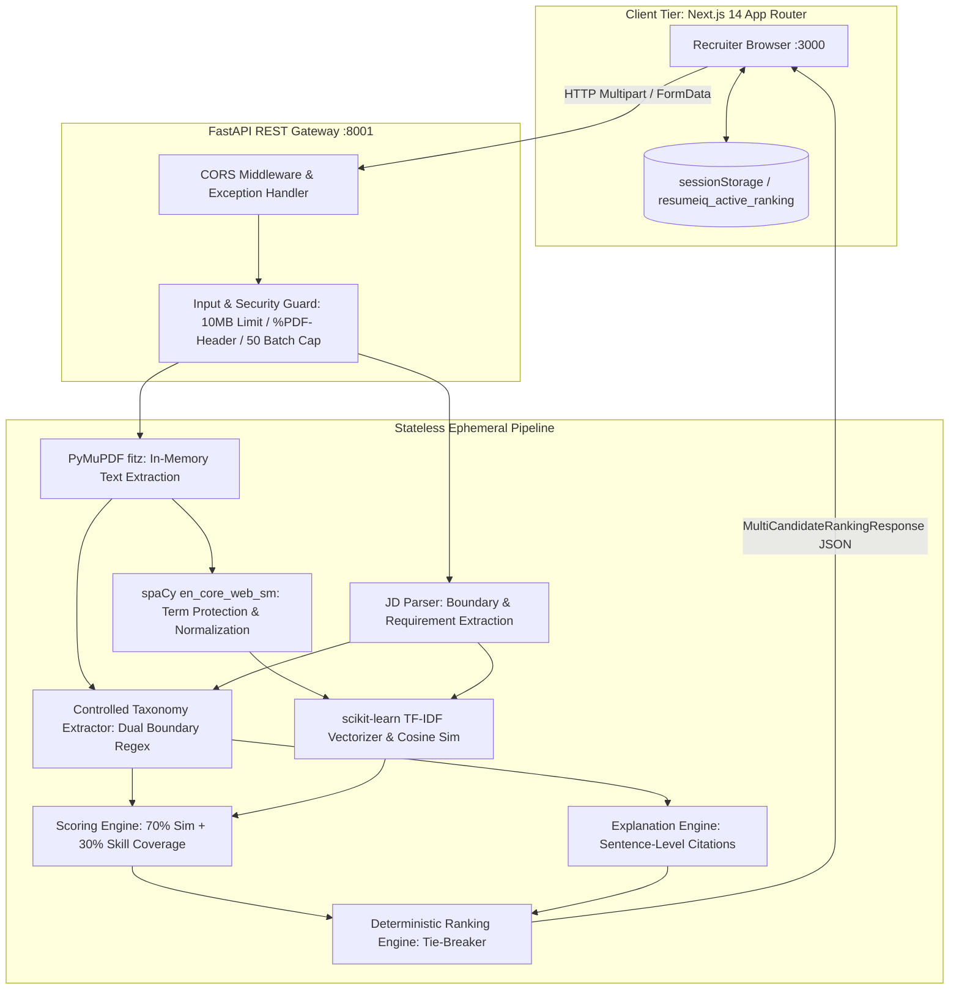

# ResumeIQ — Technical Architecture

This document details the software architecture, data flow, component interactions, and NLP pipeline of the **ResumeIQ Recruitment Intelligence Platform**.

---

## 1. System Architecture Overview

ResumeIQ is organized into two cleanly decoupled layers:
1. **Frontend Presentation & Interaction Tier:** A Next.js 14 App Router single-page application handling user interactions, PDF file ingestion, candidate comparison tables, weight adjustments, and evidence inspection modals.
2. **Backend NLP & Intelligence Tier:** A high-performance FastAPI service executing deterministic, in-memory PDF parsing, linguistic preprocessing, taxonomy-based skill extraction, TF-IDF cosine similarity, and explainable scoring.

---

## 2. In-Memory Ephemeral Data Flow

ResumeIQ processes resumes with zero server-side disk or database persistence:
1. **Multipart Upload:** Recruiter uploads up to 50 PDF resumes via `POST /api/v1/analyze/rank`.
2. **Streaming Guard:** The API reads byte streams directly into memory, verifying file size ($\le 10\text{MB}$) and file signature (`%PDF-`).
3. **PyMuPDF Extraction:** The byte buffer is passed directly to `fitz.open(stream=content, filetype="pdf")`. Text is extracted per page with character density metrics without writing files to disk.
4. **spaCy Normalization:**
   - Multi-character technical tokens are protected (e.g., `c++` $\to$ `cplusplus`, `node.js` $\to$ `nodejs`).
   - Standard text is lowercased, stripped of generic stop words, and lemmatized.
5. **Skill Extraction:**
   - Evaluated against a controlled technical taxonomy.
   - Dual-boundary regex patterns protect short and punctuated tokens (`\b` boundaries, negative lookaheads/lookbehinds for C/C++).
   - Case-sensitive deterministic handling for short programming languages (e.g., lowercase "go" rejected; "Go" and "Golang" accepted).
6. **Similarity & Scoring:**
   - `TfidfVectorizer(ngram_range=(1, 2), sublinear_tf=True)` computes cosine similarity between candidate resume and job description.
   - Skill coverage is computed strictly against explicit required skills.
   - Final score = $0.70 \times \text{Text Similarity} + 0.30 \times \text{Required Skill Coverage}$.
7. **Ranking & Delivery:**
   - Candidates sorted descending by score; ties broken deterministically by filename.
   - Results serialized to JSON and delivered to the Next.js client.
   - Byte buffers in Python are immediately garbage-collected.

---

## 3. Client-Side State & Session Management

To ensure fast navigation across the 11 user-facing routes without server database overhead:
- **`sessionStorage['resumeiq_active_ranking']`:** Holds the latest `MultiCandidateRankingResponse` payload, allowing instant drill-down from `/analysis` into `/candidates/[id]`.
- **`sessionStorage['resumeiq_notes_<id>']`:** Stores recruiter review notes per candidate.
- **Offline / Mock Fallback:** If the FastAPI backend is offline, `src/services/candidateService.ts` seamlessly falls back to local sample datasets so UI exploration is never blocked.

---

## 4. Scoring Formulation & Validation

The scoring formula is defined in `backend/app/core/config.py`:

$$\text{Overall Score} = w_{\text{sim}} \times S_{\text{sim}} + w_{\text{cov}} \times S_{\text{cov}}$$

Where:
- $w_{\text{sim}} = 0.70$ (Text Similarity Weight)
- $w_{\text{cov}} = 0.30$ (Required Skill Coverage Weight)
- Constraint: $|w_{\text{sim}} + w_{\text{cov}} - 1.0| < 10^{-5}$ enforced via Pydantic model validator at application startup.
